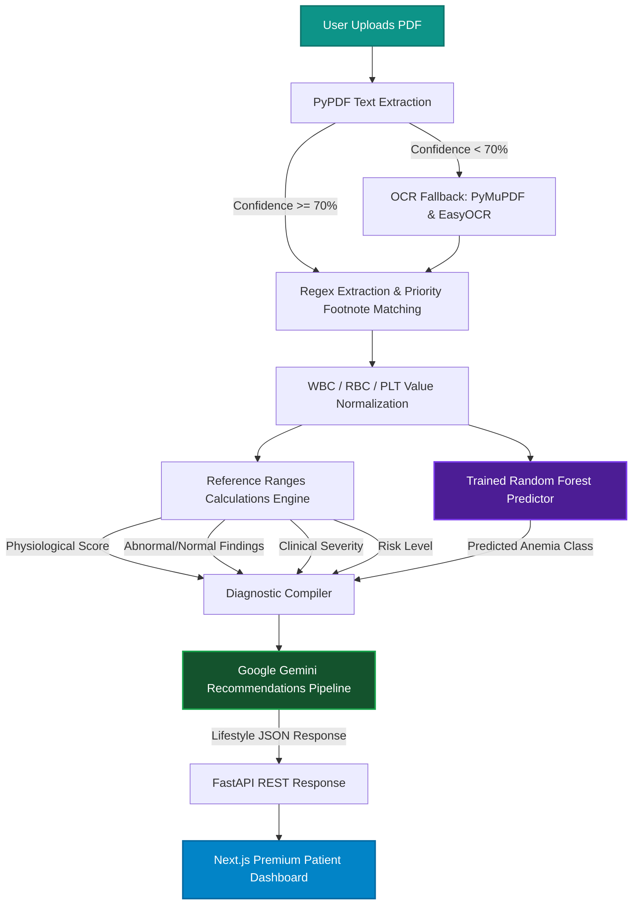
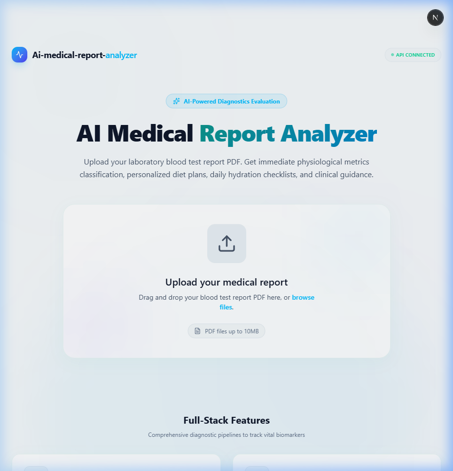

# MediScan AI (AI Medical Report Analyzer)

An intelligent, full-stack medical diagnostics application designed to parse, classify, analyze, and provide AI-guided clinical recommendations directly from Complete Blood Count (CBC) laboratory report PDFs. 

Built with a robust Python backend (FastAPI, scikit-learn, PyPDF) and a premium Next.js client interface.

---

## 🚀 Code Repository

* **GitHub Repository**: [https://github.com/Rohan-R07/Ai-medical-report-analyzer](https://github.com/Rohan-R07/Ai-medical-report-analyzer)

---

## Key Features

1. **Deterministic PDF Extraction & Normalization**: 
   * Custom parser using footnote-priority regex rules to skip superscript indices (e.g. `Hematocrit\xa001 27.3` -> extracts `27.3` instead of `01` or `1.0`).
   * Automatically normalizes non-standard unit formats for WBC, RBC, and Platelet counts to standardize standard ranges.
   * Handles flag noise (e.g. `Alert`, `Critical`, `Low`, `High`) in between values.
2. **Automated OCR Fallback**:
   * Incorporates a robust OCR fallback (using PyMuPDF and EasyOCR) to handle low-resolution scanned reports when digital text extraction is insufficient.
3. **Machine Learning Anemia Classifier**: 
   * Runs a `RandomForestClassifier` model trained on clinical hematology metrics to predict specific anemia profiles (`Normal`, `Hemoglobin Anemia`, `Iron Deficiency Anemia`, `Folate Deficiency Anemia`, `Vitamin B12 Deficiency Anemia`).
4. **Programmatic Calculations Engine**:
   * Central configuration maps CBC parameters against normal and critical thresholds.
   * Computes Physiological Score, Clinical Severity (`Normal`, `Mild`, `Moderate`, `Severe`), Risk Level (`Low`, `Moderate`, `High`), and groups `Abnormal Findings` and `Normal Findings` programmatically.
   * Derives a consistent, contradiction-free **Primary Analysis** title and summary.
5. **AI Recommendation Pipeline**:
   * Feed-forward pipeline that forwards calculated indices directly into Google's Gemini API to compile formatted lifestyle recommendations (Specialist Referrals, Diet plans, Daily Routines, Exercise, Hydration) in structured JSON format without hallucinations.
6. **Premium Medical Light Theme**:
   * Modern, clean, hospital/laboratory-themed design using soft clinic colors, cyan shadows, and elegant teal glassmorphism cards.
7. **Report Validation & Custom Dialog Alerts**:
   * Detects non-CBC PDF files (e.g. bills, resumes) and serves a high-fidelity modal dialog identifying missing expected clinical parameters (WBC, RBC, Hemoglobin, PCV, MCV, MCH, MCHC, PLT).

---

## System Architecture

Below is the complete data flow diagram of the report processing pipeline:



---

## Project Directory Structure

```
Ai-medical-analyser/
├── api/                        # Python Backend (FastAPI, ML model, and extraction logic)
│   ├── index.py                # FastAPI REST API controller
│   ├── main.py                 # ML pipeline, PDF extraction, calculations, and LLM connection
│   ├── reference_ranges.py     # Central configuration for normal limits, scoring weights, and severity categories
│   ├── anemia_model.pkl        # Serialized trained RandomForest classifier
│   └── requirements.txt        # Backend dependencies
├── app/                        # Next.js Application Pages & Components (Frontend)
│   ├── page.tsx                # Home upload page with file drop-zone & validation alerts
│   ├── dashboard/              # Patient dashboard with score dials & tables
│   ├── components/             # Reusable dashboard UI cards (Overview, Diet, Specialist, etc.)
│   ├── types/                  # TS schemas & normalizations
│   ├── lib/                    # API network request helpers
│   └── globals.css             # Styling system & animations
├── public/                     # Public assets & screenshots
├── medical_dataset.xlsx        # Excel dataset for RandomForest training
├── .env                        # Local environment credentials (Gemini API key)
├── package.json                # Frontend dependencies & scripts
├── tsconfig.json               # TypeScript configuration
└── vercel.json                 # Vercel deployment configuration
```

---

## Installation & Setup

### Prerequisites
* Python 3.8+
* Node.js 18+

### 1. Backend Setup (FastAPI & ML)
1. Clone the project and navigate to the directory:
   ```bash
   cd Ai-medical-analyser
   ```
2. Create and activate a Python virtual environment:
   ```bash
   python -m venv venv
   # On Windows:
   .\venv\Scripts\activate
   # On macOS/Linux:
   source venv/bin/activate
   ```
3. Install dependencies:
   ```bash
   pip install -r api/requirements.txt
   ```
4. Create a `.env` file in the root directory and add your Google Gemini API key:
   ```env
   GEMINI_API_KEY=your_gemini_api_key_here
   ```
5. Run the server:
   ```bash
   cd api
   python index.py
   ```
   The backend API will start on `http://localhost:8080`.

### 2. Frontend Setup (Next.js)
1. Navigate to the root folder:
   ```bash
   cd Ai-medical-analyser
   ```
2. Install npm dependencies:
   ```bash
   npm install
   ```
3. Run the Next.js development server:
   ```bash
   npm run dev
   ```
   Open `http://localhost:3000` (or `http://localhost:3001` if port 3000 is occupied) in your browser.

---

## How to Obtain a Google Gemini API Key

The backend uses Google's Gemini API to create structured, explainable health recommendations. Follow these steps to obtain your free API key:

1. Visit [Google AI Studio](https://aistudio.google.com/) and sign in with your Google account.
2. Click **Get API key** on the top-left sidebar.
3. Click **Create API key** and select or create a project.
4. Copy the generated key and paste it as the value for `GEMINI_API_KEY` in your `.env` file.

---

## 🛠️ Developed With

* **Google Gemini API** (`gemini-1.5-flash`) - AI-driven health and lifestyle analysis.
* **Antigravity (Google DeepMind)** - Engineered, optimized, and built using Google DeepMind's advanced agentic AI coding assistant.

---

## Screenshots

### Home Upload & Analysis Page (Light Medical Theme)

