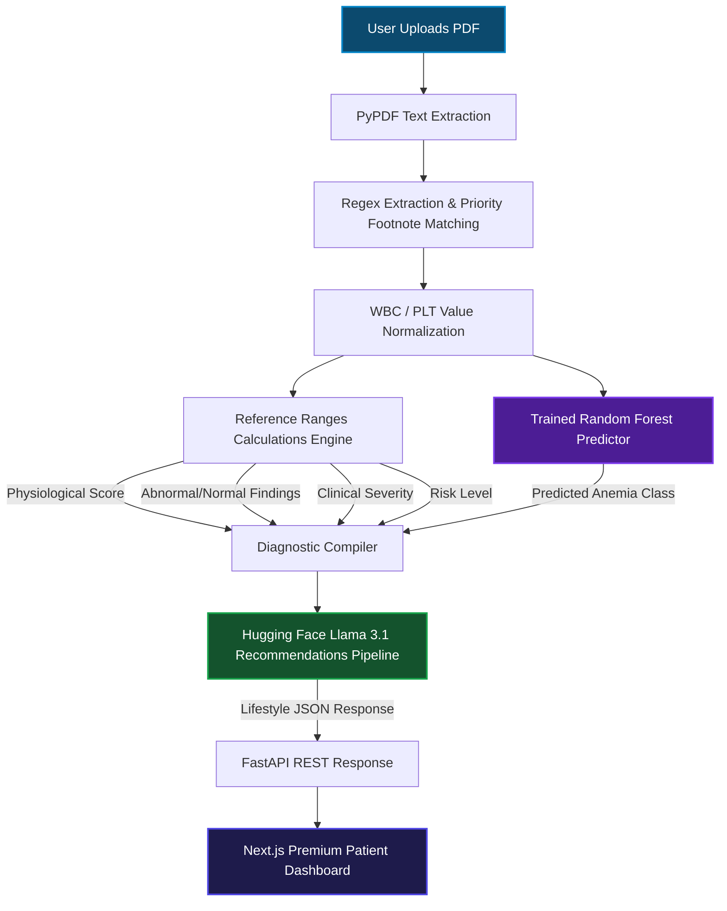

# AI Medical Report Analyzer

An intelligent, full-stack medical diagnostics application designed to parse, classify, analyze, and provide AI-guided clinical recommendations directly from Complete Blood Count (CBC) laboratory report PDFs. 

Built with a robust Python backend (FastAPI, scikit-learn, PyPDF) and a premium Next.js client interface.

---

## Key Features

1. **Deterministic PDF Extraction & Normalization**: 
   * Custom parser using footnote-priority regex rules to skip superscript indices (e.g. `Hematocrit\xa001 27.3` -> extracts `27.3` instead of `01` or `1.0`).
   * Automatically normalizes non-standard unit formats for WBC and Platelet counts (e.g., dividing absolute values by `1000.0` to standardize standard ranges).
2. **Machine Learning Anemia Classifier**: 
   * Runs a `RandomForestClassifier` model trained on clinical hematology metrics to predict specific anemia profiles (`Normal`, `Hemoglobin Anemia`, `Iron Deficiency Anemia`, `Folate Deficiency Anemia`, `Vitamin B12 Deficiency Anemia`).
3. **Programmatic Calculations Engine**:
   * Leverages a single, centralized configuration ([reference_ranges.py](file:///c:/Users/Rohan%20R/Desktop/Programming/Ai-medical-analyser/reference_ranges.py)) to map CBC parameters against normal and critical thresholds.
   * Computes Physiological Score, Clinical Severity (`Normal`, `Mild`, `Moderate`, `Severe`), Risk Level (`Low`, `Moderate`, `High`), and groups `Abnormal Findings` and `Normal Findings` programmatically.
   * Derives a consistent, contradiction-free **Primary Analysis** title and summary.
4. **AI recommendation pipeline**:
   * Feed-forward pipeline that forwards calculated indices directly into Hugging Face’s Llama 3.1 LLM to compile formatted lifestyle recommendations (Specialist Referrals, Diet plans, Daily Routines, Exercise, Hydration) in structured JSON format without hallucinations.
5. **High-Fidelity Dashboard Interface**:
   * Interactive dashboard rendering scores, abnormal findings tables, exercise routines, water logs, and print-ready reports.
6. **Report Validation & Custom Dialog Alerts**:
   * Detects non-CBC PDF files (e.g. bills, resumes) and serves a high-fidelity modal dialog identifying missing expected clinical parameters (WBC, RBC, Hemoglobin, PCV, MCV, MCH, MCHC, PLT).

---

## System Architecture

Below is the complete data flow diagram of the report processing pipeline:



---

## Project Directory Structure

```
Ai-medical-analyser/
├── main.py                     # ML pipeline, PDF extraction, calculations, and LLM connection
├── ui.py                       # FastAPI REST API controller
├── reference_ranges.py         # Central configuration for normal limits, scoring weights, and severity categories
├── medical_dataset.xlsx        # Excel dataset for RandomForest training
├── anemia_model.pkl            # Serialized trained RandomForest classifier
├── .env                        # Local environment credentials (HuggingFace token)
└── frontend-next/              # Next.js web application
    ├── app/
    │   ├── page.tsx            # Home upload page with file drop-zone & validation alerts
    │   ├── dashboard/          # Patient dashboard with score dials & tables
    │   ├── components/         # Reusable dashboard UI cards (Overview, Diet, Specialist, etc.)
    │   ├── types/              # TS schemas & normalizations
    │   ├── lib/                # API network request helpers
    │   └── globals.css         # Styling system & animations
    └── package.json
```

---

## Installation & Setup

### Prerequisites
* Python 3.8+
* Node.js 18+

### 1. Backend Setup (FastAPI & ML)
1. Clone the project and navigate to the directory:
   ```bash
   cd Ai-medical-analyser
   ```
2. Create and activate a Python virtual environment:
   ```bash
   python -m venv venv
   # On Windows:
   .\venv\Scripts\activate
   # On macOS/Linux:
   source venv/bin/activate
   ```
3. Install dependencies:
   ```bash
   pip install pandas scikit-learn openpyxl pypdf openai uvicorn fastapi python-dotenv
   ```
4. Create a `.env` file in the root directory and add your Hugging Face API key:
   ```env
   HF_TOKEN=your_hugging_face_token_here
   ```
5. Run the server:
   ```bash
   python ui.py
   ```
   The backend API will start on `http://localhost:8080`.

### 2. Frontend Setup (Next.js)
1. Navigate to the frontend folder:
   ```bash
   cd frontend-next
   ```
2. Install npm dependencies:
   ```bash
   npm install
   ```
3. Run the Next.js development server:
   ```bash
   npm run dev
   ```
   Open `http://localhost:3000` (or `http://localhost:3001` if port 3000 is occupied) in your browser.

---

## How to Obtain a Hugging Face API Token

The backend uses a Hugging Face hosted Llama model to create structured, explainable health recommendations. Follow these steps to obtain your free access token:

1. Visit [Hugging Face](https://huggingface.co/) and log in or register a free account.
2. Go to your **Profile Settings** by clicking on your avatar in the top-right corner, then selecting **Settings**.
3. In the left-hand sidebar, click on **Access Tokens**.
4. Click **New token**.
5. Configure the token options:
   * **Name**: `ai-medical-analyzer`
   * **Role**: `Read`
6. Click **Generate a token**.
7. Copy the generated token string (starts with `hf_...`) and paste it as the value for `HF_TOKEN` in your `.env` file.

---

## Screenshots

### Home Upload & Analysis Page


### Patient Diagnostics Dashboard


### Invalid Report Type Validation Dialog
