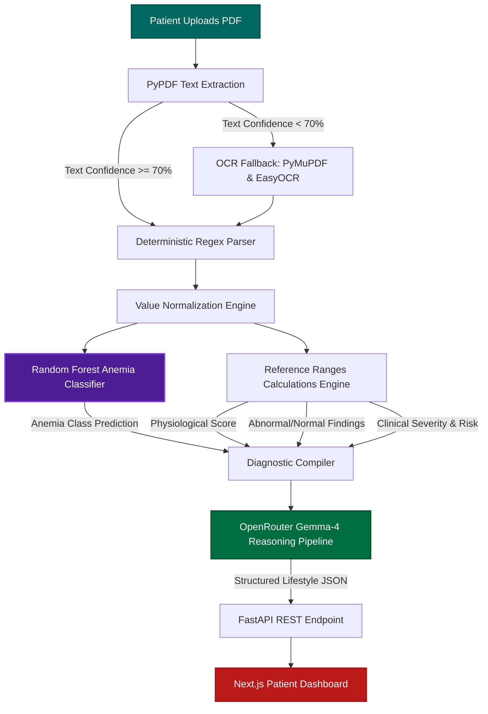
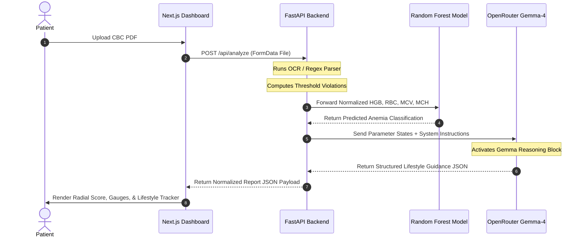
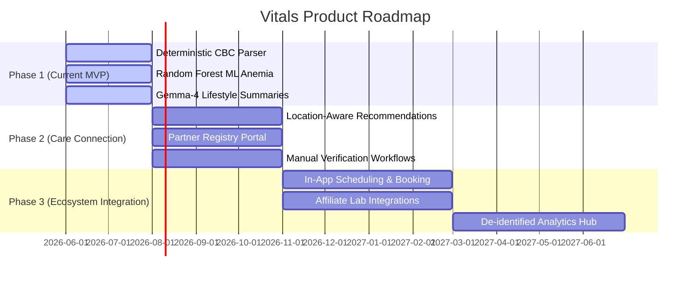

# Vitals: AI-Powered CBC Medical Report Analyzer

<p align="center">
  
</p>

<p align="center">
  <a href="#overview">Overview</a> •
  <a href="#problem-statement">Problem Statement</a> •
  <a href="#architecture">Architecture</a> •
  <a href="#features">Features</a> •
  <a href="#technology-justification">Technology Stack</a> •
  <a href="#installation-and-setup">Setup Guide</a> •
  <a href="#healthcare-partners-roadmap">Healthcare Roadmap</a> •
  <a href="#contributing">Contributing</a>
</p>

---

## Overview

**Vitals** is a premium, open-source, AI-powered healthcare intelligence platform designed to help everyday people read and understand their Complete Blood Count (CBC) reports without requiring clinical medical training.

Instead of presenting patients with complex, isolated numerical laboratory parameters, Vitals parses blood panels, processes them through trained Machine Learning models, and uses Generative AI (OpenRouter Gemma-4 with reasoning) to synthesize clear, structured, and reassuring lifestyle, dietary, and specialist referral guidelines. 

---

## Problem Statement

Complete Blood Count (CBC) panels are the most common diagnostic tests in the world, yet they remain nearly impossible for normal patients to interpret safely:
1. **Isolated Metrics:** Laboratory reports print a list of abbreviation parameters (WBC, RBC, HGB, MCV, MCH, PLT) next to numeric ranges. They do not explain how these parameters interact (e.g., how low hemoglobin and low MCV combine to indicate microcytic anemia).
2. **Alert Panic:** Seeing a flagged parameter outside reference ranges causes immediate patient anxiety, leading to premature, misleading searches on generic search engines.
3. **Clinical Burden:** General practitioners spend countless hours explaining normal or minor CBC variations to patients.

**Vitals solves this** by translating raw numeric lab values into a coordinated, patient-centric Physiological Health Score, visual parameter range tracks, conversational clinical insights, and action-oriented next steps, bridging the communication gap between diagnostics and care.

---

## Architecture

Vitals employs a feed-forward clinical pipeline consisting of deterministic parsing, machine learning classification, and generative reasoning.

### Data Flow Diagram


### System Sequence Sequence


---

## Features

### 1. Deterministic PDF Extraction & Normalization
* **Superscript Indexing Filter:** Employs footnote-priority regex parsing to skip superscript footnotes and headers that append noise to numerical outputs (e.g. converting `Hematocrit\xa001 27.3` safely into `27.3` instead of extracting `01` or `1.0`).
* **Unit Standardization:** Automatically normalizes non-standard laboratory unit variations for White Blood Cell (WBC) and Platelet (PLT) panels, ensuring values are scaled correctly relative to threshold bounds.

### 2. Automated OCR Fallback
* Ingests low-resolution scanned image PDFs using a dual-stage fallback (extracting text layers via `PyMuPDF` and routing to `EasyOCR` if character density falls below a 70% threshold).

### 3. Machine Learning Anemia Classifier
* Integrates a trained scikit-learn `RandomForestClassifier` trained on clinical hematology datasets. The model evaluates relative balances of Hemoglobin, RBC, MCV, and MCH to predict specific anemia classes:
  * `Normal`
  * `Hemoglobin Anemia`
  * `Iron Deficiency Anemia`
  * `Folate Deficiency Anemia`
  * `Vitamin B12 Deficiency Anemia`

### 4. Threshold Calculations Engine
* Maps individual parameters against clinical reference boundaries to calculate a compiled **Physiological Health Score** (out of 100) and severity index.
* Filters parameters into `Abnormal Findings` and `Normal Findings` programmatically.

### 5. OpenRouter Gemma-4 AI Pipeline
* Streams normalized clinical summaries into `google/gemma-4-26b-a4b-it` with reasoning parameters enabled (`{"reasoning": {"enabled": true}}`).
* Restricts outputs to a schema-conforming JSON structure, eliminating LLM hallucinations.

### 6. Premium Editorial User Interface
* **Biomarker Gauges:** Displays visual indicator tracks showing the patient's value mapped directly relative to low, normal, and high clinical boundaries.
* **Stateful Lifestyle Tracker:** Built-in interactive segment views including checkbox meal plans, vertical timeline routines, and a click-to-increment daily hydration glass counter.
* **Document Ingestion Modals:** Keeps dashboard results clean by loading file uploads and loading timelines inside a backdrop-blurred modal container.

---

## Technology Justification

| Technology | Role | Selection Justification |
| :--- | :--- | :--- |
| **Next.js 16** | Frontend Framework | Selected for its fast Turbopack compilation speeds, robust App Router, and static asset pre-rendering performance. |
| **FastAPI** | Backend Web API | High-performance Python async framework that integrates seamlessly with numerical calculations and ML models. |
| **Random Forest** | Anemia Classifier | An ensemble classifier chosen for its high accuracy on structured diagnostic datasets and deterministic predictability. |
| **OpenRouter Gemma-4** | Generative Specialist | Harnesses state-of-the-art open-weights reasoning blocks to compile structured medical logic without safety filter blocks. |
| **Tailwind CSS** | Styling System | Enables strict 8-point layouts, fluid hover animations, and custom clinical color tokens. |
| **TypeScript** | Type Safety | Enforces strict API contract interfaces between FastAPI responses and dashboard React props. |

---

## Folder Structure

```
Vitals/
├── api/                        # FastAPI Backend Application
│   ├── ai_provider.py          # OpenRouter completion clients & backoff retries
│   ├── classifier.py           # ML Model loading & feature matching
│   ├── parser.py               # PDF Regex extractors & OCR fallback
│   ├── index.py                # FastAPI endpoints & diagnostics
│   └── trained_model.joblib    # Trained Random Forest classifier weights
├── app/                        # Next.js App Router Frontend
│   ├── components/             # Reusable UI Components
│   │   ├── report/             # Biomarker cards & Lifestyle modules
│   │   │   └── care/           # "Continue Your Care" registry preview elements
│   │   └── shared/             # Loading timelines & Upload modals
│   ├── dashboard/              # Report results layout orchestrator
│   ├── lib/                    # API connection handlers
│   ├── types/                  # TypeScript interface contracts
│   └── globals.css             # Colors, shapes, & animations stylesheet
├── public/                     # Static SVGs, logos, & banners
├── render.yaml                 # Infrastructure configurations for Render
├── package.json                # Frontend package dependencies & scripts
├── requirements.txt            # Python backend dependencies
└── README.md                   # Repository documentation
```

---

## Installation and Setup

### Prerequisites
* Python 3.10+
* Node.js 18+
* An OpenRouter API Key (with reasoning enabled models support)

### 1. Clone the Repository
```bash
git clone https://github.com/Rohan-R07/Ai-medical-report-analyzer.git
cd Ai-medical-report-analyzer
```

### 2. Configure Environment Variables
Create a `.env` file in the root directory:
```env
# OpenRouter API Credentials
OPENROUTER_API_KEY=your_openrouter_api_key_here
OPENROUTER_MODEL=google/gemma-4-26b-a4b-it

# Next.js Public Endpoints
NEXT_PUBLIC_API_URL=http://127.0.0.1:8000
```

### 3. Backend Setup
Set up a Python virtual environment and install dependencies:
```bash
# Create venv
python -m venv venv
# Activate venv (Windows)
.\venv\Scripts\activate
# Activate venv (macOS/Linux)
source venv/bin/activate

# Install dependencies
pip install -r requirements.txt
```

Launch the FastAPI backend server:
```bash
python api/index.py
```
The backend will boot on `http://127.0.0.1:8000`.

### 4. Frontend Setup
Open a new terminal window, navigate to the root directory, and install npm packages:
```bash
npm install
```

Start the Next.js development server:
```bash
npm run dev
```
Open `http://localhost:3000` in your web browser.

---

## Product Vision & Positioning

Vitals is positioned as an **AI-powered healthcare intelligence platform**—serving as an intelligent bridge between patients and verified healthcare providers. It is:
*   **NOT** a Hospital Management System (HMS)
*   **NOT** an ad-hoc doctor booking app
*   **NOT** an automated scraping registry

Our core vision is to build a high-fidelity diagnostic interpreter for patients and coordinate their follow-up care pathways by connecting them only to clinics that have undergone manual clinical verification.

---

## Business Model

Vitals is currently **100% free** in the MVP phase, focusing entirely on solving the diagnostic communication gap. There are no advertisements or user monetization barriers in the MVP.

The future sustainability and monetization of the platform will rely on the **Verified Healthcare Partner Ecosystem**:

### 1. Verified Healthcare Partner Memberships
Hospitals, specialized clinics, and diagnostic centers pay a recurring membership fee to be listed in our verified local provider registry. Benefits include:
*   **Verified Partner badge** on patient-facing maps and cards.
*   **AI-powered patient referrals** matching the center's specific clinical specialties.
*   **Increased local visibility** in diagnostic-specific search parameters.
*   **Future clinical onboarding tools** to manage patient intake.

### 2. Referral Partnerships
When a patient opts to schedule a consultation with a listed healthcare partner based on their report findings, the partner pays a small, compliance-approved referral commission.

### 3. Consultation Booking Commission
A commission fee taken per successful appointment booked and conducted directly through the Vitals scheduling interface.

### 4. Premium Patient Subscriptions
A patient-facing premium subscription tier containing advanced longevity features:
*   **Historical Blood Panel Trends:** Track and plot biomarker changes over time.
*   **AI Health Companion:** Ongoing conversational answers regarding blood count questions.
*   **Family Health Vault:** Store and monitor panel histories for multiple family members.

### 5. Diagnostic Lab Referrals
Affiliated laboratories pay a referral fee to receive orders for follow-up blood panel draws recommended in patient lifestyle summaries.

### 6. Healthcare Analytics Portal
Privacy-preserving, aggregated, de-identified datasets sold to healthcare organizations to evaluate regional health indicators, complying strictly with patient-identifiable data regulations.

---

## Future Roadmap

The transition from a standalone report analyzer to a secure, integrated care network is structured into three phases:



---

## Contributing

We welcome open-source contributions to enhance Vitals! To contribute:
1. Fork the repository.
2. Create a feature branch: `git checkout -b feature/amazing-feature`.
3. Commit your changes: `git commit -m "feat: add amazing feature"`.
4. Push to the branch: `git push origin feature/amazing-feature`.
5. Open a Pull Request.

---

## License

This project is licensed under the MIT License - see the [LICENSE](LICENSE) file for details.

---

## Acknowledgements
* Scikit-Learn developers for the robust classification libraries.
* PyMuPDF and EasyOCR teams for text layer extraction fallbacks.
* The Google DeepMind and OpenRouter teams for power-efficient LLM reasoning APIs.