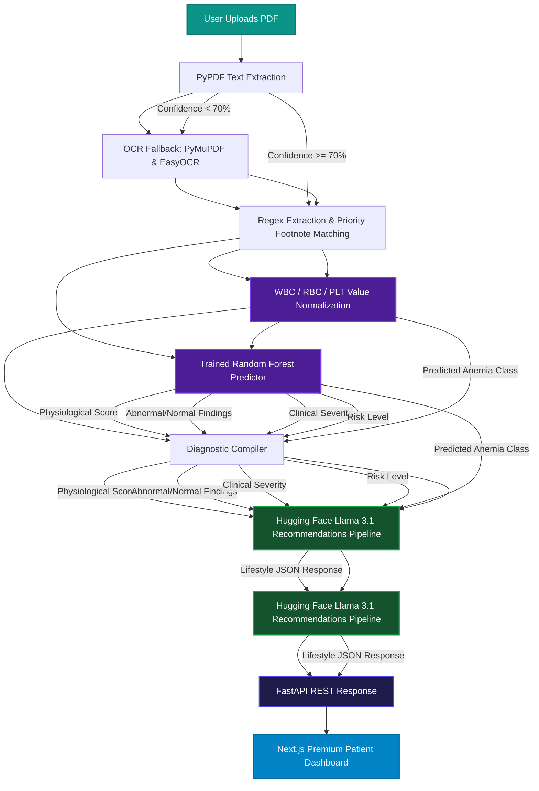

---

## Key Features

1. **Deterministic PDF Extraction & Normalization**: 
   * Custom parser using footnote-priority regex rules to skip superscript indices (e.g. `Hematocrit\xa001 27.3` -> extracts `27.3` instead of `01` or `1.0`).
   * Automatically normalizes non-standard unit formats for WBC and Platelet counts (e.g., dividing absolute values by `1000.0` to standardize standard ranges).
2. **Machine Learning Anemia Classifier**: 
   * Automatically normalizes non-standard unit formats for WBC, RBC, and Platelet counts to standardize standard ranges.
   * Handles flag noise (e.g. `Alert`, `Critical`, `Low`, `High`) in between values.
2. **Automated OCR Fallback**:
   * Incorporates a robust OCR fallback (using PyMuPDF and EasyOCR) to handle low-resolution scanned reports when digital text extraction is insufficient.
3. **Machine Learning Anemia Classifier**: 
   * Runs a `RandomForestClassifier` model trained on clinical hematology metrics to predict specific anemia profiles (`Normal`, `Hemoglobin Anemia`, `Iron Deficiency Anemia`, `Folate Deficiency Anemia`, `Vitamin B12 Deficiency Anemia`).
3. **Programmatic Calculations Engine**:
4. **Programmatic Calculations Engine**:
   * Central configuration maps CBC parameters against normal and critical thresholds.
   * Computes Physiological Score, Clinical Severity (`Normal`, `Mild`, `Moderate`, `Severe`), Risk Level (`Low`, `Moderate`, `High`), and groups `Abnormal Findings` and `Normal Findings` programmatically.
   * Derives a consistent, contradiction-free **Primary Analysis** title and summary.
4. **AI recommendation pipeline**:
5. **AI Recommendation Pipeline**:
   * Feed-forward pipeline that forwards calculated indices directly into Hugging Face’s Llama 3.1 LLM to compile formatted lifestyle recommendations (Specialist Referrals, Diet plans, Daily Routines, Exercise, Hydration) in structured JSON format without hallucinations.
5. **High-Fidelity Dashboard Interface**:
   * Interactive dashboard rendering scores, abnormal findings tables, exercise routines, water logs, and print-ready reports.
6. **Report Validation & Custom Dialog Alerts**:
6. **Premium Medical Light Theme**:
   * Modern, clean, hospital/laboratory-themed design using soft clinic colors, cyan shadows, and elegant teal glassmorphism cards.
7. **Report Validation & Custom Dialog Alerts**:
   * Detects non-CBC PDF files (e.g. bills, resumes) and serves a high-fidelity modal dialog identifying missing expected clinical parameters (WBC, RBC, Hemoglobin, PCV, MCV, MCH, MCHC, PLT).

---
@@ -33,25 +43,27 @@ Below is the complete data flow diagram of the report processing pipeline:

---
@@ -73,7 +85,7 @@ Ai-medical-analyser/
│   ├── types/                  # TS schemas & normalizations
│   ├── lib/                    # API network request helpers
│   └── globals.css             # Styling system & animations
├── public/                     # Public assets
├── public/                     # Public assets & screenshots
├── medical_dataset.xlsx        # Excel dataset for RandomForest training
├── .env                        # Local environment credentials (HuggingFace token)
├── package.json                # Frontend dependencies & scripts
@@ -152,11 +164,5 @@ The backend uses a Hugging Face hosted Llama model to create structured, explain

## Screenshots

### Home Upload & Analysis Page

### Patient Diagnostics Dashboard

### Invalid Report Type Validation Dialog

### Home Upload & Analysis Page (Light Medical Theme)
